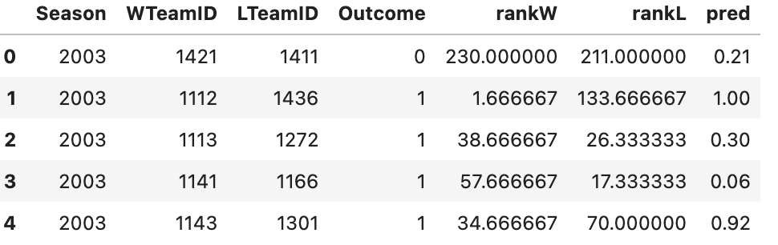
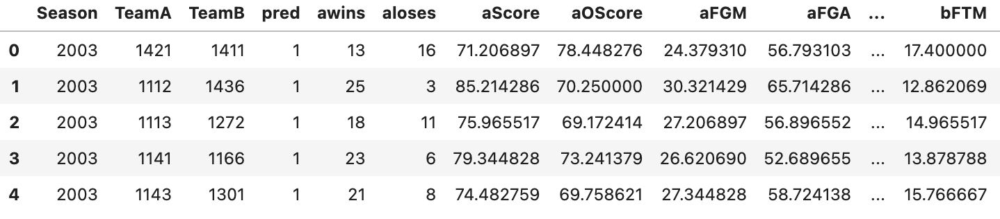
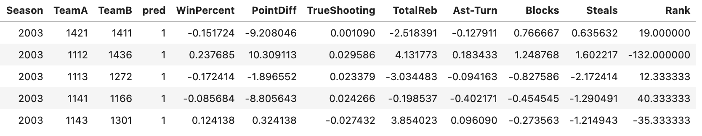
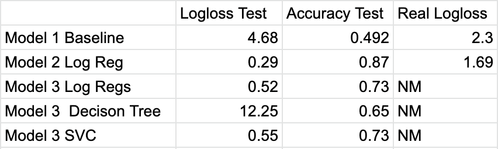

# March Madness 2022 Kaggle Competiton
### Competiton Summary 
* For many sports fans, March is a special month as the yearly college basketball tournament takes place in this month. Every single March millions of people fill out brackets trying to predict the results of all 63 games and everytime people fail misserably. This year I looked to use machine learning to predict the winner of every possible match-up in the March Machine Learning Mania 2022 - Men’s Kaggle competiton.
### Strategy
1. A baseline model which looked only the average ranking of the team on the day before the tournament. This model using an arbitray sigmoid function and does not take into account any other variables beside Rank. This should be a bad a prediction becuase a signifcant amount of games are upsets, so just going with the favorite should not work well.

2. A Logistic Regression Model using almost all stats available for both teams including wins and loses, points, field goals, three points, blocks assists etc. This model will most likely over fit the data as we have around 35 variables and only about 900 games to train on.

3. Logistic Regression, Decison Tree Classifier and SVC models using only the difference in WinPercent, PointDiff,	TrueShooting,	TotalReb,	Ast-Turn,	Blocks,	Steals, and	Rank between the two teams. By redusing complexity, these models should be able to preform the better than the models before.
 

### Results
- The results of the 3 different strategies and 5 different models are listed below. 
- Test refers to the results of the metrics on data from before the 2022 Games. Real is the score I revieved in the competion. 
- Unfortunately I was only able to submit My first 2 models and could not recieve marks on the last 3.

##### Notes
The average value that model 2 would predict on the 2022 data was 0.13, which is way too low. This could have been a result of over training as there was only 900 training values and I needed to predict around 2000 values. A potential way to fix this would be to use regular season games and not just playoff games as there are only 63 playoff games per season.

